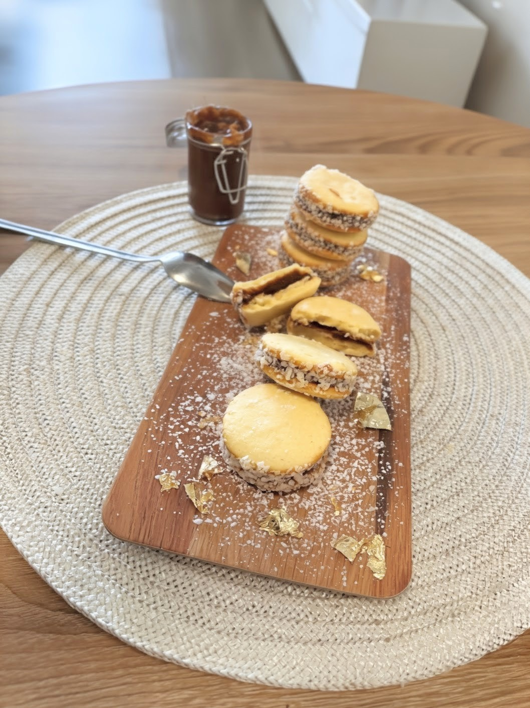
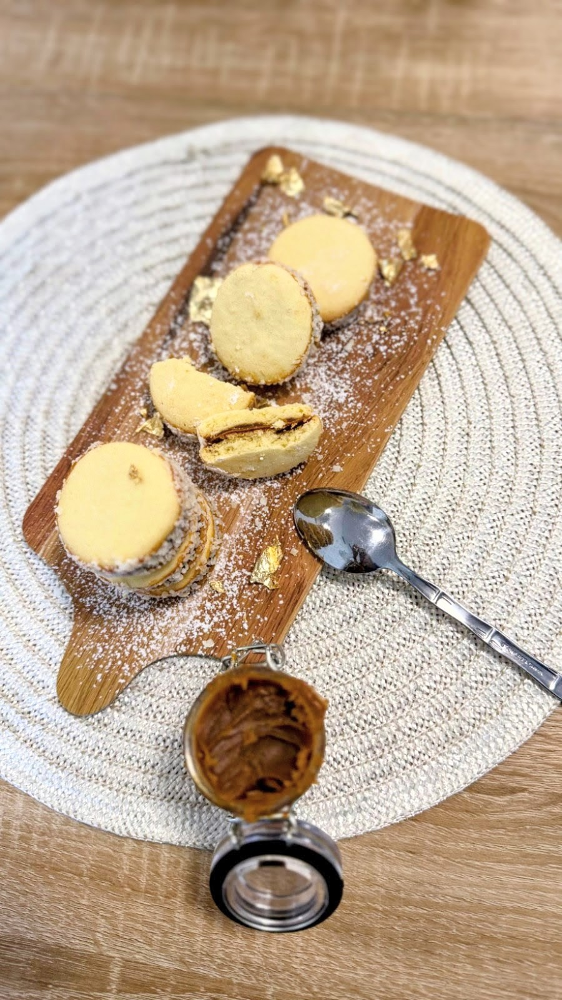
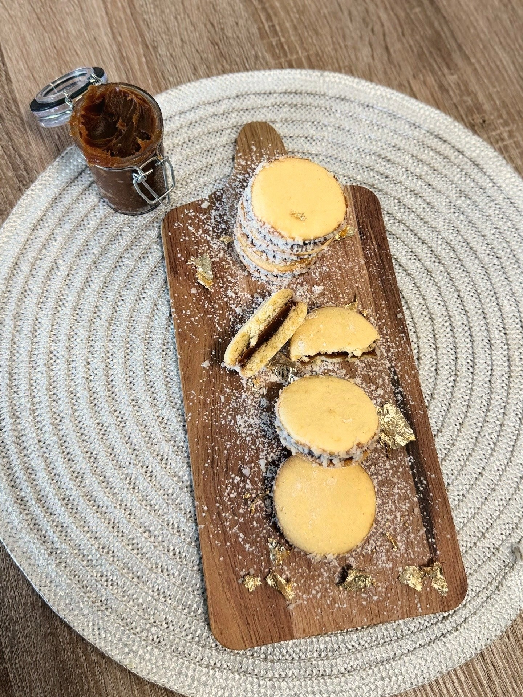

# El Dulce de la Nonna

> Live client website for an artisan alfajores bakery in Miami, FL. Custom-order workflow with 48-hour advance validation, dual-email confirmation, and allergen disclosure — built on Laravel 13 with Blade + Tailwind CSS v4.

**Real client project · Live at [losalfajoresdelanona.com](https://losalfajoresdelanona.com) · Built under [Dual-Stack Studio](https://github.com/Dual-Stack-Studio)**

---

## Product

<div align="center">

| Alfajores | Presentación | Selección |
|-----------|-------------|-----------|
|  |  |  |

</div>

**Live pages:** [Home](https://losalfajoresdelanona.com) · [Order form](https://losalfajoresdelanona.com/encargar) · [About](https://losalfajoresdelanona.com/sobre-mi)

---

## Overview

El Dulce de la Nonna is a live client website for an artisan alfajores bakery based in Miami, Florida. The site handles the full custom-order lifecycle: a customer fills out an order form, a 48-hour advance notice rule is enforced server-side, and two emails fire simultaneously — one notifying the owner of a new order, and one sending the customer a confirmation with payment and cancellation terms.

No database is needed for orders. The owner receives structured order details by email and coordinates payment and delivery directly. This keeps the architecture minimal, maintenance-free, and cost-zero to operate.

---

## Features

- **Order form** — nombre, email, teléfono, dirección, fecha deseada, detalle del pedido
- **48-hour advance validation** — Carbon enforces minimum 2-day lead time server-side; requests submitted too close are rejected with Spanish-language error messages
- **Dual email on submit** — owner receives full order details; customer receives acknowledgment with payment and cancellation terms
- **Allergen disclosure** — prominently lists GLUTEN, LÁCTEOS, HUEVO, COCO + frutos secos environment
- **WhatsApp chat button** — one-tap contact for mobile users
- **Server-rendered** — no JavaScript framework; pure Blade templates with Tailwind CSS v4 and Vite
- **Responsive** — mobile-first layout, tested on mobile and desktop

---

## Tech Stack

| Layer | Technology |
|-------|-----------|
| Framework | Laravel 13 |
| Language | PHP 8.3+ |
| Templating | Blade (server-rendered) |
| Styling | Tailwind CSS v4 + Vite |
| Email | Laravel Mail (Mailables) |
| Validation | Laravel Form Validation |
| Date logic | Carbon (48h advance check) |
| Testing | PHPUnit 12 |

---

## Architecture

```
Browser
  │
  │  GET /           → welcome.blade.php   (hero + products)
  │  GET /encargar   → EncargoController@create  (order form)
  │  POST /encargar  → EncargoController@store
  │                     ├─ Validate: nombre, email, teléfono, dirección, fecha, detalle
  │                     ├─ Carbon: fecha >= today + 48h  →  reject if too soon
  │                     ├─ Mail::to(owner)  → NuevoEncargoMail
  │                     └─ Mail::to(client) → ConfirmacionEncargoClienteMail
  │  GET /sobre-mi   → PageController@sobreMi   (baker bio + photo)
  └─ GET /privacidad → PageController@privacidad (privacy policy)
```

---

## Order Flow

1. Customer visits `/encargar` and submits the form
2. Laravel validates all fields server-side with Spanish-language messages
3. Carbon checks the requested date is at least 48 hours in the future — requests that are too soon are rejected
4. `NuevoEncargoMail` fires to the owner's configured address (`MAIL_TO_ADDRESS`) with full order details
5. `ConfirmacionEncargoClienteMail` fires to the customer's email with acknowledgment and terms
6. Customer is redirected to a thank-you confirmation

---

## Email Classes

| Class | Recipient | Subject |
|-------|-----------|---------|
| `NuevoEncargoMail` | Owner (`config('mail.to_address')`) | Nuevo pedido - El Dulce de la Nona |
| `ConfirmacionEncargoClienteMail` | Customer (submitted email) | Hemos recibido tu pedido - El Dulce de la Nona |

---

## Routes

| Method | URI | Handler | Description |
|--------|-----|---------|-------------|
| `GET` | `/` | Closure | Homepage (product showcase) |
| `GET` | `/encargar` | `EncargoController@create` | Order form |
| `POST` | `/encargar` | `EncargoController@store` | Submit + validate + send emails |
| `GET` | `/sobre-mi` | `PageController@sobreMi` | About page |
| `GET` | `/privacidad` | `PageController@privacidad` | Privacy policy |

---

## Setup

**Prerequisites:** PHP 8.3+, Composer, Node.js 20+

```bash
git clone https://github.com/sebitacasa/los-alfajores-de-la-nonna.git
cd los-alfajores-de-la-nonna
composer run setup
```

The `setup` script handles everything: `composer install` → app key → migrate → `npm install` → `npm run build`.

### Environment

```env
APP_NAME="El Dulce de la Nonna"
APP_ENV=production
APP_URL=https://losalfajoresdelanona.com

MAIL_MAILER=smtp
MAIL_HOST=smtp.yourprovider.com
MAIL_PORT=587
MAIL_USERNAME=pedidos@losalfajoresdelanona.com
MAIL_PASSWORD=
MAIL_FROM_ADDRESS=pedidos@losalfajoresdelanona.com
MAIL_FROM_NAME="El Dulce de la Nonna"
MAIL_TO_ADDRESS=pedidos@losalfajoresdelanona.com
```

For local development, swap `MAIL_MAILER=log` to see emails in `storage/logs/laravel.log`.

---

## Testing

```bash
composer run test
# Runs: php artisan config:clear && php artisan test (PHPUnit 12)
```

---

## Business Details

| | |
|--|--|
| Location | Miami, Florida |
| Product | Artisan alfajores — $15.00 / docena |
| Contact | pedidos@losalfajoresdelanona.com · +1 (754) 275-0615 |
| Order window | 48-hour advance notice required |
| Cancellation | Up to 24 hours before delivery |
| Payment | Coordinated on confirmation (no online payment processing) |
| Allergens | GLUTEN · LÁCTEOS · HUEVO · COCO · frutos secos environment |

---

## Project

Real client project built under **[Dual-Stack Studio](https://github.com/Dual-Stack-Studio)** using an adapted Scrum methodology.

Live site: **[losalfajoresdelanona.com](https://losalfajoresdelanona.com)**

© 2025 Dual-Stack Studio — all rights reserved
